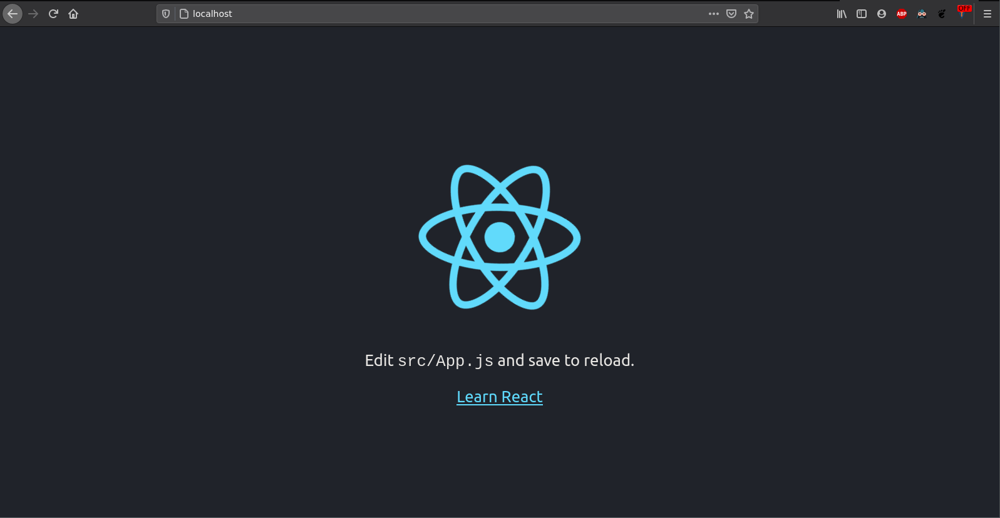

# Creación de una aplicacion React


## Creación de una imagen Apache 

Para la creación de este servidor utilizaremos la imagen [httpd](https://hub.docker.com/_/httpd), en la que haremos deploy de un servidor Apache, para más adelante en el workshop, hagamos deployment de un frontend en React a través de esta imagen.

[ ! ] El repositorio desde el que empezamos es: [https://github.com/mark-doblefilo/pas-workshop](https://github.com/mark-doblefilo/pas-workshop) o también podemos utilizar: _npx create-react-app pas-workshop_

### Creando nuestra imagen con Dockerfile

Primero de todo, para generar una imagen a partir de la imagen base httpd, necesitaremos crear nuestra propia imagen. Para ello creamos el archivo Dockerfile:

```Docker
FROM httpd

EXPOSE 80

CMD ["httpd-foreground"]
```

Tras esto, ejecutariamos el siguiente comando en terminal:

```shell
docker build -t apache-image .
```

Con el siguiente resultado:
```
Sending build context to Docker daemon  191.1MB
Step 1/3 : FROM httpd
 ---> 0b932df43057
Step 2/3 : EXPOSE 80
 ---> Using cache
 ---> 024fc3423791
Step 3/3 : CMD ["httpd-foreground"]
 ---> Using cache
 ---> dc01a168338b
Successfully built dc01a168338b
Successfully tagged apache-image:latest
```

### Creando nuestro contenedor a partir de la imagen Apache
Ya tenemos creada nuestra imagen con nombre _apache-image_. Lo siguiente sería generar el contenedor para iniciar y probar nuestra imagen:

```
docker run -d --name apache-container -p 8080:80 apache-image
```

!!! comando 
    Podríamos ver el estado del contenedor ejecutando:
        ```
        docker ps
        ```

Ahora podemos entrar en la página web, recordemos que con la flag p hemos asignado el puerto 80 de nuestro apache (puerto por defecto) al puerto 8080 de nuestro localhost. Para probar nuestro contenedor abriremos un navegador e iremos a localhost:8080


## Creando nuestro entorno de desarrollo en React

Para crear nuestro entorno de desarrollo utilizaremos otra imagen, en este caso utilizaremos [node](https://hub.docker.com/_/node). Node.js es una plataforma basada en Javascript para server-side y networking applications. Además esta imagen base nos permite algo denominado _hot reload_ tal que cuando modifiquemos alguna cosa en nuestro código se actualice en nuestro contenedor y podamos verlo al instante.

Además utilizaremos docker-compose que nos permitirá facilitarnos la construcción de la imagen y el contenedor.

### Creando nuestro Dockerfile y docker-compose

Como en la anterior caso, empezaremos con la creación de un Dockerfile, en este caso partiremos de una imagen base diferente pero que nos ayudará en nuestra etapa de desarrollo.

```Docker
FROM node:13.12.0-alpine

WORKDIR /app

# /app/node_modules/.bin to $PATH
ENV PATH /app/node_modules/.bin:$PATH

COPY package.json ./
COPY package-lock.json ./
RUN npm install --silent
RUN npm install react-scripts@3.4.1 -g --silent

COPY . ./

CMD ["npm", "start"]
```

Crearemos un .dockerignore para hacer que la creación de nuestra imagen sea mucho más rápida:

```
node_modules
build
.dockerignore
Dockerfile
Dockerfile.prod
```

Y por último crearemos el docker-compose.yml:
```yaml
version: '3.7'

services:
       react-service:
                container_name: react-container
                build:
                        context: .
                        dockerfile: Dockerfile
                volumes:
                        - '.:/app'
                        - '/app/node_modules'
                ports:
                        - 8080:3000
                environment:
                        - CHOKIDAR_USEPOLLING=true
```

### Creando nuestro entorno de producción

Seguiremos con los mismos pasos (Dockerfile y docker-compose):

**Dockerfile.prod**
```Docker
# STAGE 1
FROM node:13.12.0-alpine as build

WORKDIR /app

# /app/node_modules/.bin to $PATH
ENV PATH /app/node_modules/.bin:$PATH

COPY package.json ./
COPY package-lock.json ./
RUN npm ci --silent
RUN npm install react-scripts@3.4.1 -g --silent

COPY . ./

RUN npm run build

# STAGE 2
FROM httpd
COPY --from=build /app/build /usr/local/apache2/htdocs

EXPOSE 80

CMD ["httpd-foreground"]
```

**docker-compose.prod.yml**
```yaml
version: '3.7'

services:
        react-prod:
                container_name: react-prod
                build:
                        context: .
                        dockerfile: Dockerfile.prod
                ports:
                        - '80:80'
```

Para ejecutar nuestros servicios de producción utilizaremos:

```shell
docker-compose -f "docker-compose.prod.yml" up -d --build
```

!!! importante
    El comando _docker-compose ps_ nos mostrará los servicios de un fichero (por defecto: docker-compose.yml). Si nuestro fichero tiene un nombre diferente, entonces lo tendremos que indicar con la flag -f "example.yml".

Y ya tendremos nuestro React dockerizado y en producción, el puerto indicado es 80 (conexiones http), entonces al abrir un navegador y poner en la URL:

**localhost:80**
