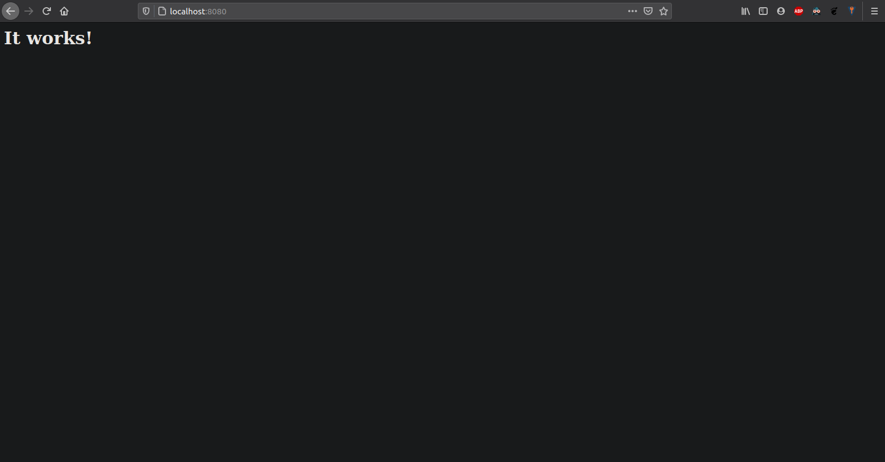

# Creación de un contenedor Apache

Para la creación de este servidor utilizaremos la imagen [httpd](https://hub.docker.com/_/httpd), en la que haremos deploy de un servidor Apache, para más adelante en el workshop, hagamos deployment de un frontend en React a través de esta imagen.

[ ! ] El repositorio desde el que empezamos es: [https://github.com/mark-doblefilo/pas-workshop](https://github.com/mark-doblefilo/pas-workshop) o también podemos utilizar: _npx create-react-app pas-workshop_

## Creando nuestra imagen Dockerfile

Primero de todo, para generar una imagen a partir de la imagen base httpd, necesitaremos crear nuestra propia imagen. Para ello creamos el archivo Dockerfile:

```Docker
FROM httpd

EXPOSE 80

CMD ["httpd-foreground"]
```

Tras esto, ejecutariamos el siguiente comando en terminal:

```shell
docker build -t apache-image .
```

Con el siguiente resultado:
```
Sending build context to Docker daemon  191.1MB
Step 1/3 : FROM httpd
 ---> 0b932df43057
Step 2/3 : EXPOSE 80
 ---> Using cache
 ---> 024fc3423791
Step 3/3 : CMD ["httpd-foreground"]
 ---> Using cache
 ---> dc01a168338b
Successfully built dc01a168338b
Successfully tagged apache-image:latest
```

## Creando nuestro contenedor a partir de la imagen
Ya tenemos creada nuestra imagen con nombre _apache-image_. Lo siguiente sería generar el contenedor para iniciar y probar nuestra imagen:

```
docker run -d --name apache-container -p 8080:80 apache-image
```

!!! comando 
    Podríamos ver el estado del contenedor ejecutando:
        ```
        docker ps
        ```

Ahora podemos entrar en la página web, recordemos que con la flag p hemos asignado el puerto 80 de nuestro apache (puerto por defecto) al puerto 8080 de nuestro localhost. Para probar nuestro contenedor abriremos un navegador e iremos a localhost:8080



## 