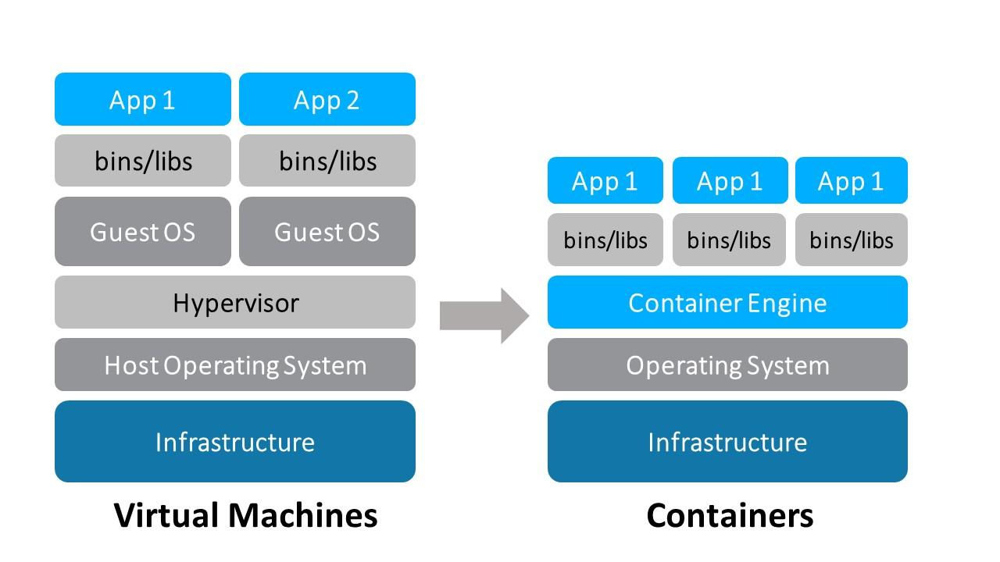

# ¿Qué es Docker?

### Según Wikipedia:

Docker es un proyecto de código abierto que automatiza el despliegue de aplicaciones dentro de contenedores de software, proporcionando una capa adicional de abstracción y automatización de virtualización de aplicaciones en múltiples sistemas operativos. Docker utiliza características de aislamiento de recursos del kernel Linux, tales como cgroups y espacios de nombres (namespaces) para permitir que 'contenedores' independientes se ejecuten dentro de una sola instancia de Linux, evitando la sobrecarga de iniciar y mantener máquinas virtuales.

### Según “Scalable and resilient Django with Kubernetes”:

You can colloquially think of Docker containers as fat static binaries of your apps. They bundle your application code, the underlying libraries and all the necessary bits your app needs to run into a convenient package — one that can be run on a thin layer directly over the Linux kernel. What this means in practice is that you can take a container that you’ve built once and run it on different versions of Linux distributions, or entirely different Linux distributions. Everything should work seamlessly.

## ¿Está docker virtualizado?

En GNU/Linux Docker no es virtualizado, no hay un hipervisor. Los procesos que corren dentro de un contenedor de docker se ejecutan con el mismo kernel que la máquina anfitrión. Linux lo que hace es aislar esos procesos del resto de procesos del sistema, ya sean los propios de la máquina anfitrión o procesos de otros contenedores. Además, es capaz de controlar los recursos que se le asignan a esos contenedores (cpu, memoria, red, etc.). Internamente, el contenedor no sabe que lo es y a todos los efectos es una distribución GNU/Linux independiente, pero sin la penalización de rendimiento que tienen los sistemas virtualizados.

Así que, cuando ejecutamos un contenedor, estamos ejecutando un servicio dentro de una distribución construida a partir de una "receta". Esa receta permite que el sistema que se ejecuta sea siempre el mismo, independientemente de si estamos usando Docker en Ubuntu, Fedora o, incluso, sistemas privativos compatibles con Docker. De esa manera podemos garantizar que estamos desarrollando o desplegando nuestra aplicación, siempre con la misma versión de todas las dependencias.

Obviamente, si ejecutamos contenedores GNU/Linux dentro de sistemas privativos, sí habrá virtualización.

## ¿A quien le interesa esto?

Docker es útil a administradores de sistemas, pero también a desarrolladores. Uno de los problemas que se presentan durante el desarrollo y despliegue de aplicaciones es encontrarnos con sistemas heterogéneos, no ya entre los desarrolladores, también entre los sistemas de pruebas, pre-producción y producción. Es decir, que los desarrolladores y los sistemas donde se ejecuta la aplicación tienen librerías y sistemas operativos diferentes. ¿Y por qué es un problema? Pues porque la aplicación puede funcionar bien en una distribución de GNU/Linux pero no bien en otra, o ejecutarse bien con la versión de un lenguaje pero no con otra. Para asegurar la calidad de desarrollo tenemos que asegurar que todo el mundo usa las mismas versiones de todas las aplicaciones y librerías necesarios.

Esto es más complicado de lo que parece, porque hay desarrolladores que prefieron una distribución concreta, o incluso sistemas privativos. Incluso los sistemas de pruebas, pre-producción y producción suelen ser distintos. Los sistemas de producción suelen ser más nuevos y potentes y los antiguos se dejan para pruebas y pre-producción.

Otro problema es que un mismo desarrollador o un mismo sistema de despliegue tenga que trabajar en más de un proyecto que requiera versiones distintas de librerías, complicándolo aún más.

Docker viene a solucionar todos estos problemas, tanto para los desarrolladores como para los administradores de sistemas. Con Docker podemos crear entornos aislados con configuraciones que serán exactamente igual siempre.

## Conceptos básicos

Antes de comenzar a instalar y usar docker es importante tener una serie de conceptos claros:

Demonio de docker (docker daemon) : Es el proceso principal de docker. Escucha peticiones a la API y maneja los objetos de docker: imágenes, contenedores, redes, volúmenes. También es capaz de comunicarse con otros demonios para controlar servicios docker.

Cliente de docker (docker client) : Es la principal herramienta que usan los administradores de sistema para interaccionar con el sistema Docker.

Registro de docker (docker registry) : Es el lugar donde se almacenan las imágenes de Docker y poder descargarlas para reutilizarlas. Docker Hub es el principal registro público de Docker y contiene ya un montón de imágenes listas para ser usadas de multitud de servicios (mysql, wordpress, etc).
