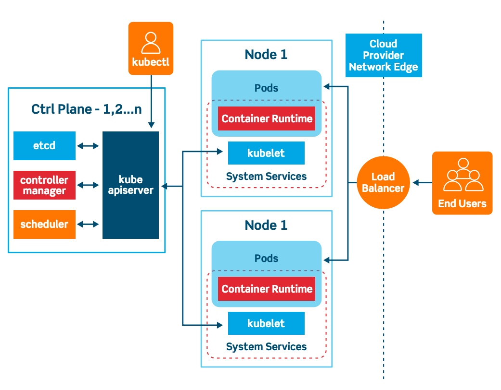

# Arquitectura de Kubernetes:

Como hemos visto, un cluster de kubernetes esta formado por un `nodo Master` y de `2 a n nodos Worker`
Como vemos en la imagen, Un nodo Master se comunica con los otros nodos 1 y 2.

Vamos a ver nodo por nodo cuales son las herramientas que componen la arquitectura de nuestro cluster:

 

 

En nuestro nodo Master encontramos `etcd`, `controller manager`, `scheduler` y `kube api-server`.

- etcd: Base de datos clave-valor del cluster, para almacenar información del mismo.

- controller manager: Controla en todo momento el estado del cluster, para vigilar, por ejemplo, que el número de pods desplegados sea el estimado.

- scheduler: Orquesta en qué nodo de despliega cada pod que creemos.

- kube api-server: expone la `API de kubernetes`. Esto lo hace comunicandose con el `kubelet` de cada nodo y con el `kubectl`.

 

Ahora vamos a ver los componentes del nodo:

- pods: cada pod desplegado en el nodo, con sus respectivos `contenedores y volumenes`.

- kubelet: se comunica con la API de kubernetes gracias al `kube api-server`

 

Otros objetos de la arquitectura de kubernetes:

- kubectl: interprete de comandos para terminal de kubernetes. Es la forma más simple de comunicarnos con la kube api.

- load balancer: tipo de servicio que se encarga de redirigir peticiones entre los nodos para, como su nombre indica, 'balancear la carga' y no sobrecargar nodos mientras otros no reciben tráfico.
