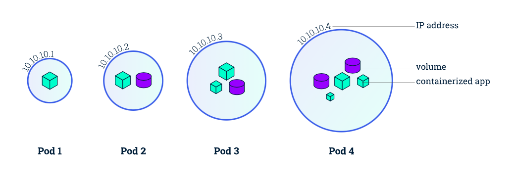
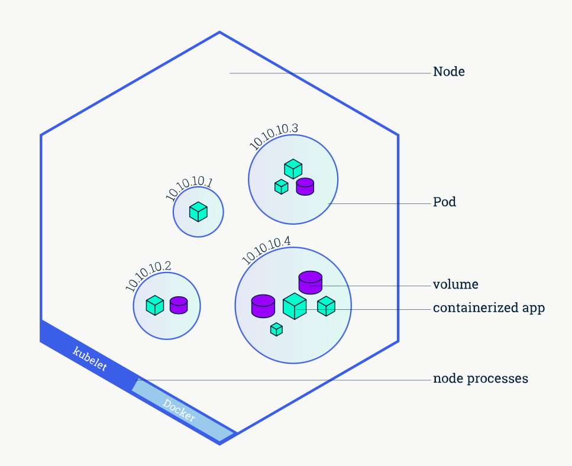
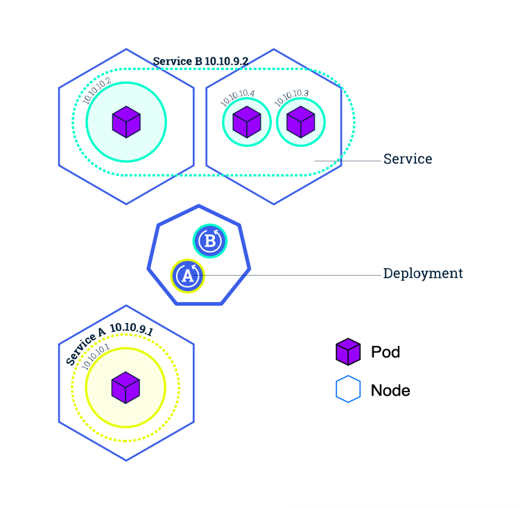
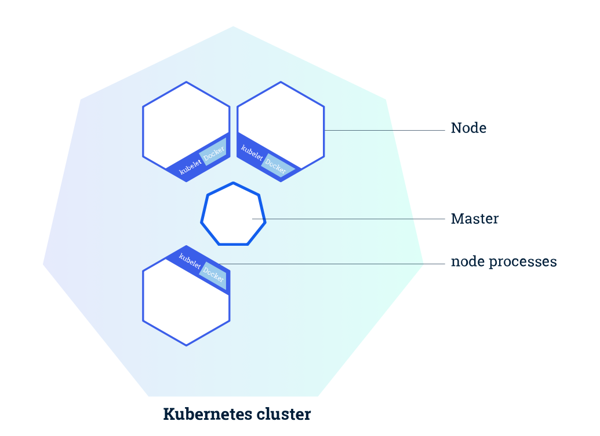

# Conceptos básicos

Vamos a ver algunos conceptos básicos que deberíamos conocer:

## Pods

Los Pods son la unidad mínima de Kubernetes. Cada nodo tendra de 1 a n pods, y cada uno puede tener dentro contenedores, volumenes o ambos. Estos se levantan cuando se crea un Deployment, y se encuentran como contenedores dentro de los `nodos`.
Cada pod puede contener un contenedor, un volumen y varios mezclados.
Un ejemplo claro de pod con varios contenedores seria el de una app donde en un contenedor se encuentra nuestra app y en otro nuestra base de datos.

Cada pod cuenta con una IP propia dentro de nuestro equipo, lo que nos permitirá comunicarlos entre ellos de forma organizada.

## Nodos

Hace referencia a cada máquina de nuestro cluster. Cada ordenador/servidor que use nuestro cluster será un nodo. En nuestro Cluster existirá un nodo Master y n nodos Worker. La estructura del nodo Master es distinta a la de los nodos worker que tienen todos la misma. El nodo contendrá Pods y Volumenes, cada uno con su IP propia.

Cada nodo ejecuta `kubelet` para comunicarse con el nodo Master, y un gestor de contenedores, `Docker`en la mayoría de los casos.

## Servicios

Los servicios son abstracciones que nos facilitan comunicar nodos y sus respectivos pods.
Por ejemplo, uno de los usos mas basicos es el de comunicar y dirigir el trafico entre pods. Esto permite que si un pod "muere", podamos crear una replica nueva de dicho pod y redirigir el trafico, lo que permite que la aplicación no sufra el impacto de la muerte del pod.

## Cluster

Como hemos dicho antes, nuestro cluster a partir de ahora va a ser nuestro 'todo'. Este estará compuesto por nuestros nodos Worker y el nodo Maser.

!!! Aviso

    El tamaño minimo de nuestro cluster debe ser de un nodo Master y dos Worker.

Como podemos ver en la imagen, nuestro nodo Master es el encargado de comunicarse con los demás. Veremos cómo lo hace en la seccion 'Arquitectura de Kubernetes'

## Despliegue

Un controlador de Deployment proporciona actualizaciones declarativas para los Pods y los ReplicaSets.

Cuando describes el estado deseado en un objeto Deployment, el controlador del Deployment se encarga de cambiar el estado actual al estado deseado de forma controlada. Puedes definir Deployments para crear nuevos ReplicaSets, o eliminar Deployments existentes y adoptar todos sus recursos con nuevos Deployments.

