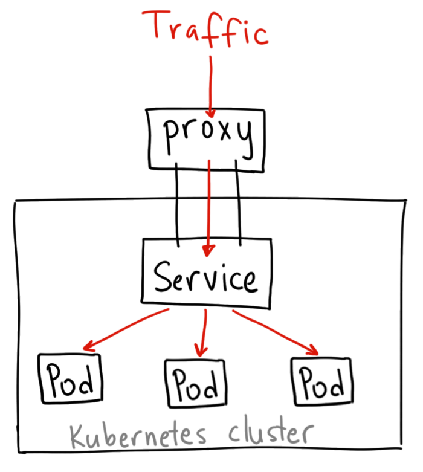
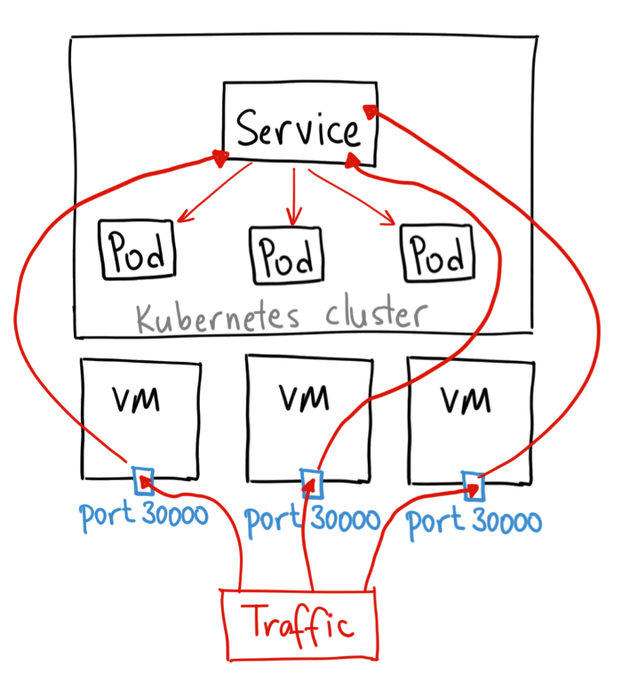

# Conceptos básicos

Vamos a ver varios conceptos que debemos conocer:

- Cluster: Conjunto de maquinas (ordenadores físicos, servidores, etc.) y todo su contenido. Por así decirlo, podemos definirlo como un 'todo'.

- Nodos: Cada máquina de nuestro cluster. Cada ordenador/servidor que use nuestro cluster será un nodo. En nuestro Cluster existirá un nodo Master y n nodos Worker.

- Pod: Unidad mínima de nuestro sistema. Cada nodo tendra de 1 a n pods, y cada uno puede tener dentro contenedores, volumenes o ambos.

- Servicios: Abstraccion que define los Pods que funcionan en los nodos de nuestro cluester y como se accede a estos.

<br>

Ahora que ya conocemos que objetos existen en un cluster de Kubernetes, vamos a definirlos en profundidad.

<br>

## Cluster

Como hemos dicho antes, nuestro cluster a partir de ahora va a ser nuestro 'todo'. Este estará compuesto por nuestros nodos Worker y el nodo Maser.

!!! Aviso

    El tamaño minimo de nuestro cluster debe ser de un nodo Master y dos Worker.


Como podemos ver en la imagen, nuestro nodo Master es el encargado de comunicarse con los demás. Veremos cómo lo hace en la seccion 'Arquitectura de Kubernetes'

<br>

## Pods

Los Pods son la unidad mínima de Kubernetes. Estos se levantan cuando se crea un Deployment, y se encuentran como contenedores dentro de los `nodos`.
Cada pod puede contener un contenedor, un volumen y varios mezclados.
Un ejemplo claro de pod con varios contenedores seria el de una app donde en un contenedor se encuentra nuestra app y en otro nuestra base de datos.


Cada pod cuenta con una IP propia dentro de nuestro equipo, lo que nos permitirá comunicarlos entre ellos de forma organizada.

<br>

## Nodos

Cada nodo será cada máquina de nuestro cluster. La estructura del nodo Master es distinta, pero la de los nodos worker son todas la misma. El nodo contendrá Pods y Volumenes, cada uno con su IP propia.


Cada nodo ejecuta `kubelet` para comunicarse con el nodo Master, y un gestor de contenedores, `Docker`en la mayoría de los casos.

<br>

## Servicios

Como dijimos en la definición, los servicios son abstracciones que nos facilitan comunicar nodos y sus respectivos pods.
Por ejemplo, uno de los usos mas basicos es el de comunicar y dirigir el trafico entre pods. Esto permite que si un pod "muere", podamos crear una replica nueva de dicho pod y redirigir el trafico, lo que permite que la aplicación no sufra el impacto de la muerte del pod.


<br>

## Tipos de servicios:

- ClusterIP: El servicio toma una IP interna del cluster y hace que dicho servicio solo sea accesible a traves del cluster.

  

  ```
  $ cat clusterIP-service.yaml

  apiVersion: v1
  kind: Service
  metadata:
   name: my-internal-service
  spec:
  selector:
   app: my-app
  type: ClusterIP
  ports:

  - name: http
    port: 80
    targetPort: 80
    protocol: TCP
  ```

  <br>

- NodePort: Expone el servicio a cada Nodo a traves de la IP de estos.

  

  ```
  $ cat nodePort-service.yaml

  kind: Service
  metadata:
    name: my-nodeport-service
  spec:
    selector:
      app: my-app
    type: NodePort
    ports:
    - name: http
      port: 80
      targetPort: 80
      nodePort: 30036
      protocol: TCP
  ```

  <br>

- Load Balancer: Expone le servicio de forma externa utilizando un balanceador (cloud, si se puede) y genera automaticamente un NodePort y un ClusterIP.

  

  ```
  $ cat loadBalancer-service.yaml

  apiVersion: extensions/v1beta1
  kind: Ingress
  metadata:
    name: my-ingress
  spec:
    backend:
      serviceName: other
      servicePort: 8080
    rules:
    - host: foo.mydomain.com
      http:
        paths:
        - backend:
            serviceName: foo
            servicePort: 8080
    - host: mydomain.com
      http:
        paths:
        - path: /bar/*
          backend:
            serviceName: bar
            servicePort: 8080
  ```

  <br>

- ExternalName: Mapea el servicio al exterior con un nombre definido.

  ```
  $ cat externalName-service.yaml

  apiVersion: extensions/v1beta1
  kind: Service
  apiVersion: v1
  metadata:
    name: my-service
  spec:
    type: ExternalName
    externalName: my.service.example.com
  ```

  <br>

- Ingress: no es un servicio como tal, actua como un 'enrutador de servicios'

  

  ```
  $ cat ingress.yaml

  apiVersion: extensions/v1beta1
  kind: Ingress
  metadata:
  name: my-ingress
  spec:
    backend:
      serviceName: other
      servicePort: 8080
    rules:
    - host: foo.mydomain.com
      http:
        paths:
        - backend:
            serviceName: foo
            servicePort: 8080
    - host: mydomain.com
      http:
        paths:
        - path: /bar/*
          backend:
            serviceName: bar
            servicePort: 8080
  ```

  <br>
