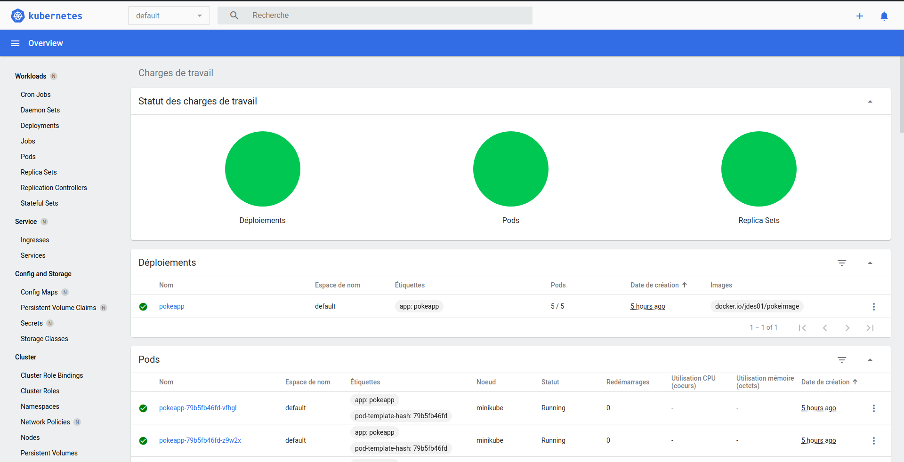
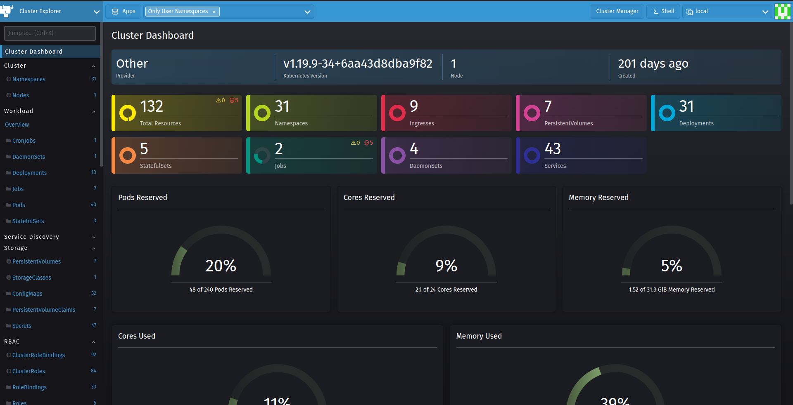

# Dashboard

El Dashboard es una interfaz de usuario de Kubernetes basada en web. Puede utilizar su Dashboard para implementar aplicaciones en contenedores en un clúster de Kubernetes, solucionar problemas de su aplicación con los contenedores y administrar los recursos del clúster. 

Además puede utilizar su Dashboard para obtener una descripción general de las aplicaciones que se ejecutan en su clúster, así como para crear o modificar recursos individuales de Kubernetes (como implementaciones, trabajos, DaemonSets, etc.). Por ejemplo, puede escalar una implementación, iniciar una actualización continua, reiniciar un pod o implementar nuevas aplicaciones con un asistente de implementación.

El panel también proporciona información sobre el estado de los recursos de Kubernetes en su clúster y sobre cualquier error que pueda haber ocurrido.

Existen distintos tipos de Dashboard que podemos utilizar para visualizar y trabajar con toda esta información. Pero los principales son:

## Kubernetes-Dashboard

## Rancher

Aunque ambos ofrecen características y funcionalidades similares. Existen algunas diferencias que debemos de tener en cuenta ya que pueden hacer que nos decantemos por uno u otro a la hora de administrar nuestro servidor. Profundizaremos más sobre ellas en el siguiente ejemplo.