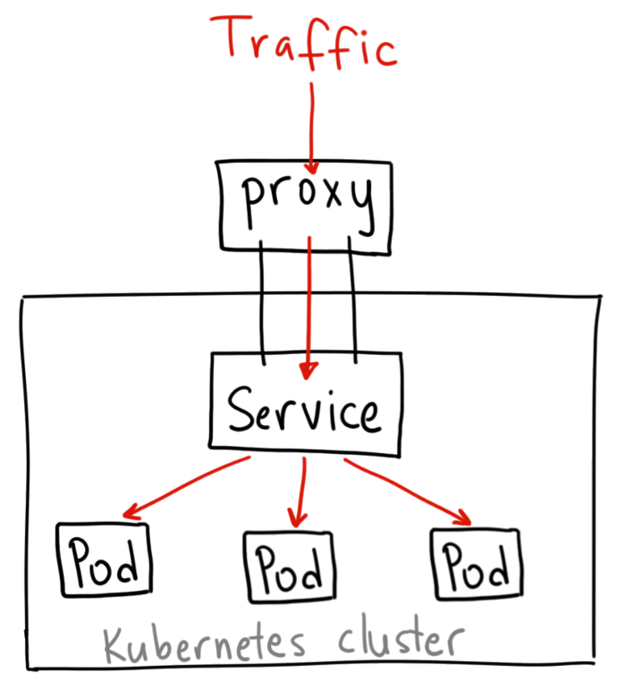
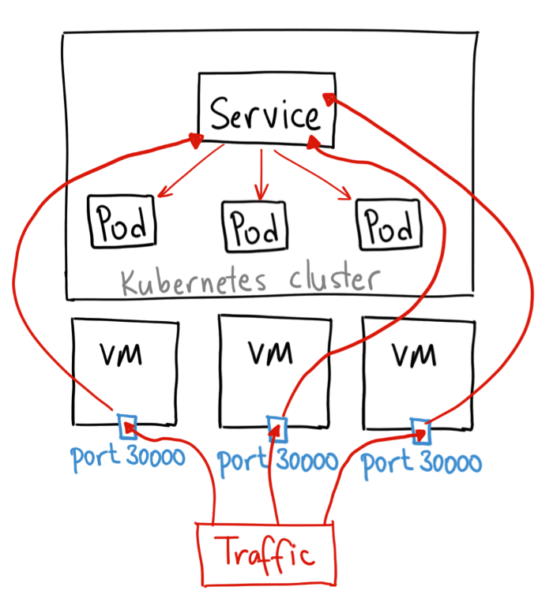
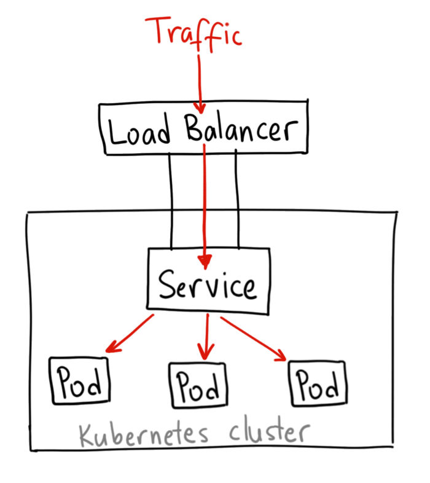
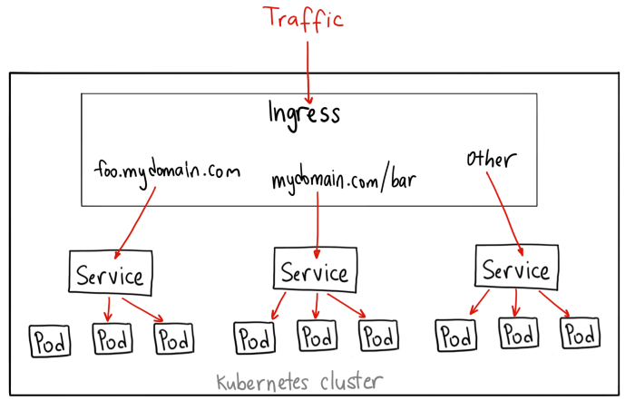

# Tipos de servicios

## ClusterIP:

El servicio toma una IP interna del cluster y hace que dicho servicio solo sea accesible a traves del cluster.

<br>



```
$ cat clusterIP-service.yaml

apiVersion: v1
kind: Service
metadata:
 name: my-internal-service
spec:
selector:
 app: my-app
type: ClusterIP
ports:

- name: http
  port: 80
  targetPort: 80
  protocol: TCP
```

  <br>

## NodePort:

Expone el servicio a cada Nodo a traves de la IP de estos.

<br>



```
$ cat nodePort-service.yaml

kind: Service
metadata:
  name: my-nodeport-service
spec:
  selector:
    app: my-app
  type: NodePort
  ports:
  - name: http
    port: 80
    targetPort: 80
    nodePort: 30036
    protocol: TCP
```

  <br>

## Load Balancer:

Expone le servicio de forma externa utilizando un balanceador (cloud, si se puede) y genera automaticamente un NodePort y un ClusterIP.

<br>



```
$ cat loadBalancer-service.yaml

apiVersion: extensions/v1beta1
kind: Ingress
metadata:
  name: my-ingress
spec:
  backend:
    serviceName: other
    servicePort: 8080
  rules:
  - host: foo.mydomain.com
    http:
      paths:
      - backend:
          serviceName: foo
          servicePort: 8080
  - host: mydomain.com
    http:
      paths:
      - path: /bar/*
        backend:
          serviceName: bar
          servicePort: 8080
```

<br>

## ExternalName:

Mapea el servicio al exterior con un nombre definido.

<br>

```
$ cat externalName-service.yaml

apiVersion: extensions/v1beta1
kind: Service
apiVersion: v1
metadata:
  name: my-service
spec:
  type: ExternalName
  externalName: my.service.example.com
```

<br>

## Ingress:

no es un servicio como tal, actua como un 'enrutador de servicios'

<br>



```
$ cat ingress.yaml

apiVersion: extensions/v1beta1
kind: Ingress
metadata:
name: my-ingress
spec:
  backend:
    serviceName: other
    servicePort: 8080
  rules:
  - host: foo.mydomain.com
    http:
      paths:
      - backend:
          serviceName: foo
          servicePort: 8080
  - host: mydomain.com
    http:
      paths:
      - path: /bar/*
        backend:
          serviceName: bar
          servicePort: 8080
```

<br>
